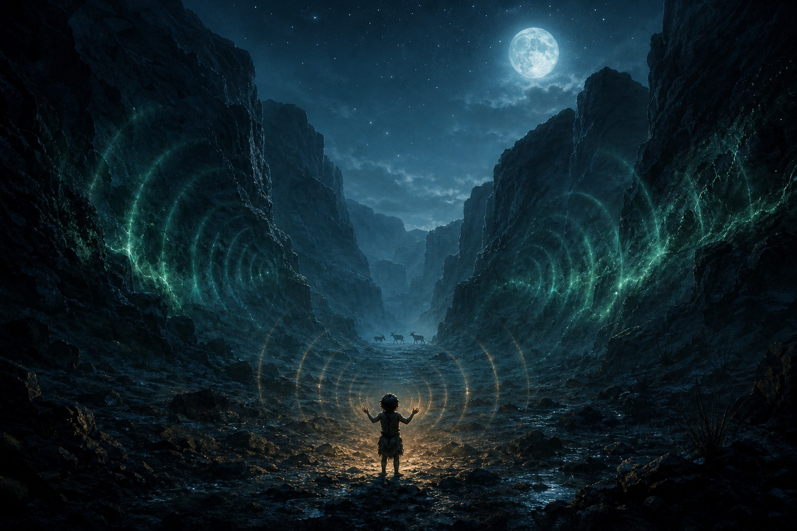

# 「活着的星球」愿景页 · 插画出图与替换 交接文档

> **文档性质**：Handoff 文档。上一阶段已完成 `docs/living-planet-vision.html` 的骨架、文案与占位 SVG，整体表达效果已被产品同事确认。本文档把「用 GPT Image 出正式插画 → 替换页面内所有占位 SVG」这项工作交接给下一个 agent（面向 codex）独立执行完成。
>
> **版本**：v1
> **产出日期**：2026-07-02
> **依赖上下文**：
> - `docs/living-planet-vision.html` — 当前页面（含所有占位 SVG 与 CSS）
> - `docs/superpowers/plans/2026-07-02-living-planet-vision-html.md` — 该页的实施计划，包含设计系统契约与内容契约
> - 姐妹页视觉基因参考：`docs/grail-war-agent-vision.html` + `docs/assets/grail-war-agent-vision/` 里的实拍/概念图（电影感、深色调、真实质感 —— 我们的插画审美与之同流）
>
> **交接给谁读**：任何被指派"为活着的星球愿景页出图并替换"的 agent（默认 codex）。读完本文档 + `docs/living-planet-vision.html` 一份即可独立开工，不需要回读对话。

---

## 0. 快速定位（30 秒读完你在做什么）

- **目标产出**：为 `docs/living-planet-vision.html` 出 **7 张 jpg 插画**，并把页面内的 **8 处占位 SVG** 全部替换成 `` 引用（Hero 星球一张图对应两处 SVG 使用，见下）。
- **交付路径**：图片放 `docs/assets/living-planet-vision/`（需自己新建目录），页面直接改 `docs/living-planet-vision.html`。
- **出图工具**：GPT Image（1024×1024 / 1024×1536 / 1536×1024 三种画布尺寸）。
- **提交纪律**：本仓库惯例是"一个交付物一个 commit"。**最终 commit 需向用户确认后再执行**。commit message 用简体中文。
- **允许自主决策**：图片风格微调、prompt 迭代、CSS 尺寸/aspect-ratio 微调、SVG 装饰性图层是否保留 —— 都由你决定。文案不改、页面结构不改、色板不改（见第 4 节红线）。

---

## 1. 页面当前状态

### 1.1 页面结构

```
Hero 首屏（星球主视觉，右侧 SVG）
Part 1 · 核心思路（纯文本 + 卡片，无图）
Part 2 · 交流途径（一张宽幅通道 SVG）
Part 3 · 文明演绎五幕（守望者人格）
  ├─ 第一幕 · 蒙昧 —— 回声（一张 SVG）
  ├─ 第二幕 · 农耕 —— 立约（一张 SVG）
  ├─ 第三幕 · 工业 —— 失聪（一张 SVG）
  ├─ 第四幕 · 科学 —— 重听（一张 SVG）
  └─ 第五幕 · 相认 —— 共生（一张 SVG）
Part 4 · 组合想象（一张宽幅组合星图 SVG）
```

### 1.2 设计系统契约（不可改动）

```css
--bg:     #06110c   /* 深林黑绿 */
--aurora: #5ce6a8   /* 生物荧光绿（星球/回应） */
--glow:   #8ff0c8
--cyan:   #6fd7e8   /* 数据/科学/精神通道 */
--amber:  #f0b45c   /* 文明火光 */
--ember:  #ff7a5c   /* 工业创伤 */
```

**页面视觉基因**：深色 editorial · 大号衬线标题 · aurora 绿是"星球说话时"的信号色 · 电影质感（不要 stock illustration / 不要卡通 / 不要 3D 渲染味）。姐妹页 `docs/assets/grail-war-agent-vision/*.jpg` 的整体调子（电影胶片、真实、有戏剧氛围）就是我们要的审美目标。

---

## 2. 交付物清单（8 处占位 → 7 张 jpg）

**保存路径**：`docs/assets/living-planet-vision/`

| 编号 | 文件名 | 用途 | 出图画布 | 页面显示尺寸 |
|---|---|---|---|---|
| IMG-01 | `hero-living-planet.jpg` | Hero 星球主视觉 | 1024×1024（正方形） | 380×380 (CSS 可缩放) |
| IMG-02 | `channels-mind-core.jpg` | Part 2 通道图 | 1536×1024（横向 3:2） | 全宽 max 1000px |
| IMG-03 | `act1-echo-canyon.jpg` | 第一幕 · 蒙昧-回声 | 1024×1024（后期裁 3:2）或直接出 1536×1024 | 560×360 (3:2 → 略调) |
| IMG-04 | `act2-covenant-fields.jpg` | 第二幕 · 农耕-立约 | 1536×1024 | 同上 |
| IMG-05 | `act3-deaf-industry.jpg` | 第三幕 · 工业-失聪 | 1536×1024 | 同上 |
| IMG-06 | `act4-storm-tracks.jpg` | 第四幕 · 科学-重听 | 1536×1024 | 同上 |
| IMG-07 | `act5-city-aurora.jpg` | 第五幕 · 相认-共生 | 1536×1024 | 同上 |
| IMG-08 | `combinations-triaxis.jpg` | Part 4 组合星图 | 1536×1024 | 全宽 max 1000px |

**格式**：全部导出 jpg，质量 85–92 之间，控制单图 ≤ 500KB（页面加载性能）。

**建议画布策略**：五幕小图与两张横幅（IMG-02、IMG-08）都用 1536×1024（3:2）。当前 SVG 的 aspect-ratio 是 560:360 = 14:9 ≈ 1.56:1，出图 3:2 = 1.5:1，差异极小，页面 CSS 里 `.act-img` 的 `aspect-ratio` 改成 `3/2` 即可（第 5 节有具体改点）。Part 2 与 Part 4 原本是 1200:520 = 2.31:1 的宽横幅，改成 3:2 后视觉重心可能需要 prompt 里主动引导（居中构图、留白），或者页面接受 3:2 显示（视觉更饱满，反而更好）。

---

## 3. 每张图详细 brief

> **通用风格锚点**（每张 prompt 都可套用这段做基底，请在英文 prompt 里稳定复用）：
>
> `cinematic concept art, moody atmosphere, painterly digital painting, dark palette with subtle bio-luminescent accents, filmic depth of field, no text, no logo, no watermark, no borders, no cartoon or anime style, no 3D render look, high artistic quality, awards-level composition`

---

### IMG-01 · Hero 星球主视觉 `hero-living-planet.jpg`

**位置**：`docs/living-planet-vision.html` 中 `<header class="hero">` 内 `<div class="hero-planet">` 里的 `<svg class="planet-svg">` (约 500-530 行附近)。

**要传达**：一颗**活着的、有意识的**星球——温柔而有存在感，是"母体"，不是冰冷的星球标本。观众第一眼要感到："这是一个能听见你的世界。"

**关键视觉要素**：
- 星球主体：森林 + 海洋星球，有明显的大气层柔光轮廓
- 星球表面：模糊可见的、像**神经/血管/发光河流**的生物荧光纹路（aurora 绿 `#5ce6a8`），若隐若现地布满暗面
- 夜半球有星星点点的**文明灯火**（琥珀色 `#f0b45c` 的极小亮点，不多，几十个足矣）
- 星球外围：一圈极其内敛的**极光晕圈 / 磁场光环**（aurora 绿+青 `#6fd7e8`，宽度只是星球半径的 5-10%，不要戴光环）
- 背景：深空（`#06110c`），有很少的星尘，避免银河系密集星场喧宾夺主

**参考感觉**：《星际穿越》Miller 星、Beeple 的星球插画、Poliigon 的行星概念图、Terragen 渲染但带手绘感、《沙丘》里 Arrakis 从太空俯瞰的一幕。

**避免**：地球写实照片；卡通土星光环；星战式战舰在旁；NASA 官方图那种"科普硬核"；星球表面刻意绘出大陆轮廓。

**Prompt（English, primary）**：
```
A living, conscious planet floating in deep space, viewed from moderate distance filling ~60% of the frame. Dark forest-and-ocean world with a thin luminous atmosphere. Its dark surface is faintly veined with bio-luminescent green filaments — like nerves or glowing rivers pulsing beneath the crust. The night side shows tiny scattered amber embers of civilization lights, quiet and sparse. A subtle aurora halo (green-cyan) hugs the planet's rim, extremely restrained. Background: dark void #06110c with minimal star dust, no galaxy, no nebula clutter. Cinematic concept art, moody atmosphere, painterly digital painting, dark palette with bio-luminescent green (#5ce6a8) and amber (#f0b45c) accents, filmic depth of field, awards-level composition. No text, no logo, no watermark, no borders, no cartoon or anime style, no photorealistic Earth reference.
```

**Prompt（中文说明·辅助迭代）**：
一颗深色森林+海洋的星球悬浮在深空里，占画面 60% 左右。星球暗面隐约可见生物荧光绿的神经状纹路（像血管/发光河流）。夜半球有稀疏的琥珀色文明灯火（点状）。星球轮廓有一圈很内敛的极光青绿色晕圈。背景是纯深空、极少星尘。情绪：温柔、内敛、有生命感、"它在看着我们"。

**验收标准**：
- 观感是"活着的、能感知的"星球，不是死星球
- 生物荧光纹路清晰可辨但不喧宾夺主
- 深色调整体压得住，不亮堂
- 无文字、无边框、无 logo

---

### IMG-02 · Part 2 通道图 `channels-mind-core.jpg`

**位置**：`docs/living-planet-vision.html` 中 `<div class="channel-svg-wrap">` 内的 `<svg viewBox="0 0 1200 520">`（约 580-620 行附近）。

**要传达**："文明的行为是输入，星球用身体和精神两种通道回应" —— 一张能量流示意图。

**关键视觉要素**（3:2 构图重新组织）：
- 画面中央：一颗小型"心智核"（Hero 星球的缩略同源，同样的生物荧光绿光晕，但更抽象、更像一个心脏/眼睛）
- 画面左半：四种文明行为的**象征性剪影**沿弧线汇入心智核 —— 篝火（狩猎/蒙昧）、犁与麦（农耕）、烟囱（工业）、天线塔（科技）。剪影小而黑，被弧线光带牵引
- 画面右半：两束能量流从心智核发散
  - **上/右上**：aurora 绿的束流 —— 化作云、鸟群阵形、水流（身体通道）
  - **下/右下**：cyan 青色的束流 —— 化作梦的波纹、闭眼人像剪影、抽象梦境符号（精神通道）
- 全画面：有机弧线连接一切，禁止方框流程图观感

**参考感觉**：日本设计大师原研哉/佐藤大的抽象海报、Refik Anadol 的数据艺术、Studio Ghibli 概念图里精灵世界的能量流、"神经网络可视化"但艺术化。

**避免**：Ted 演讲风格的信息图；箭头方框；卡通图标；PowerPoint 感。

**Prompt (English)**：
```
Abstract cinematic energy flow diagram, 3:2 landscape. Center: a small luminous mind-core (like a heart or eye of a planet), radiating bio-luminescent green (#5ce6a8) glow. Left half: four small dark silhouettes of civilization behaviors — a campfire, a plow with wheat, an industrial smokestack, a radio tower — arranged along organic arcing lines that flow into the core, each carrying a subtle amber ember trail. Right half: two energy streams flowing outward from the core; the upper stream in aurora green transforming into clouds, bird flocks, and rivers (body channel); the lower stream in cool cyan (#6fd7e8) transforming into dream ripples, an abstract silhouette of a closed-eye human profile, and dream-like symbols (mind channel). Everything connected by organic curves, no rectangles, no arrows. Deep #06110c background with subtle nebula texture. Painterly, abstract, editorial art style, moody atmosphere, filmic depth. No text, no infographic labels, no logo.
```

**Prompt（中文说明）**：
一张 3:2 的抽象能量流构图。中央有一颗小的"心智核"（发光的心/眼）。左半是四个小小的文明行为剪影（篝火/犁与麦/烟囱/天线塔），沿有机弧线流入核心。右半分成两束能量流出：上束（aurora 绿）化作云、鸟群、水流；下束（青色）化作梦的波纹、闭眼人像剪影。全图有机曲线，禁止方框和箭头。深色 editorial 抽象风格。

**验收标准**：
- 三区（输入 / 心智核 / 双向输出）视觉分组清晰
- 有机曲线为主，看不到直角/箭头/框
- 色彩分层符合：文明行为=暗+琥珀微光 / 心智核=aurora / 身体通道=aurora / 精神通道=cyan

---

### IMG-03 · 第一幕 · 蒙昧-回声 `act1-echo-canyon.jpg`

**幕文案（不改）**：
> 当孩子第一次对着峡谷哼出调子，它没有现身——它只是让风把这段调子完整地哼了回来。旱季来临，兽群"迷了路"，一路走向饥饿的部落——它不施舍食物，只是让食物出现在能被找到的地方。

**要传达**：星球第一次以最轻柔的方式回应人类——不是神迹，而是"世界在听"的一次极小的确证。

**关键视觉要素**：
- 月色下的深峡谷，剪影般的岩壁
- 峡谷底部一个孩子的小小剪影（背影或侧影），朝峡谷张开双手或抬头哼唱
- 声波纹从孩子发出（暖色/极浅），穿过峡谷；一部分被峡谷"哼回来"（回来的波纹用 aurora 绿，极细，几乎难以察觉——但存在）
- 天空有一轮清冷的月，星星稀疏
- 远处可以隐约有几头鹿的剪影穿过画面（暗示第二个例子"兽群迷了路"）

**色调**：teal（青灰）冷调、月光、寂静。极少暖光（只在孩子附近有一点点微光）。

**情绪**：好奇、敬畏、原始、寂静。

**Prompt (English)**：
```
Cinematic painting, 3:2 landscape. A moonlit deep canyon at night, dark rocky silhouettes flanking both sides, cold teal-blue palette. In the canyon floor, a tiny silhouette of a prehistoric child seen from the back, arms slightly raised, humming toward the canyon walls. Faint warm sound-wave ripples emanate from the child, traveling into the canyon. Barely visible aurora-green (#5ce6a8) sound-wave ripples travel back from the canyon walls toward the child — the planet gently returning the tune. A pale cold moon in the top sky, sparse stars. In the far distance, three deer silhouettes are quietly walking across the canyon opening. Hushed, intimate, awe-struck atmosphere. Cinematic concept art, painterly, moody, filmic depth of field, no text, no logo, no borders, no cartoon style.
```

**Prompt（中文说明）**：
月光下的深峡谷，冷青蓝色调。峡谷底部一个孩子的背影小剪影，抬手朝峡谷哼唱。孩子发出淡淡暖色声波纹进入峡谷；峡谷回响的声波纹是极淡的 aurora 绿。天上一轮冷月、稀星。远处有三头鹿剪影穿过画面（回应"兽群迷了路"）。情绪：好奇、原始、敬畏、极静。

---

### IMG-04 · 第二幕 · 农耕-立约 `act2-covenant-fields.jpg`

**幕文案（不改）**：
> 当村落学会用祭祀求雨，它开始让雨水应验祭祀的历法——但只应验善待土地的村落。焚山、毁林的村落，它不降灾罚——只是收回了曾经给它们的季候恩惠：虫害与干旱"恰好"落在那里。

**要传达**：星球升级为"可以立约的神"。它以气候作为反馈，善待土地的得福，毁林的失去恩惠。

**关键视觉要素**：
- 前景：一片规整的田野与祭坛，祭坛上有烟升起（琥珀色暖光）；祭坛上方的云层开始下起细雨（生物荧光绿的雨丝，暗示"应验"）
- 远景（画面右侧或深处）：一片焚山毁林的村落被虫害/干旱笼罩，天空是干燥的赭石色，田地枯黄，无雨——形成"善报 vs 撤保护"的对照
- 时间是黄昏，"金色时刻"的光线

**色调**：琥珀色（amber）+ 生物荧光绿的雨 + 焚林一侧的赭石/干旱橙。

**情绪**：交换、庄重、约定；同时有隐约的分野感（善待 vs 索取）。

**Prompt (English)**：
```
Cinematic painting, 3:2 landscape, golden hour lighting. Foreground: an ancient village's neatly tilled fields at dusk, a small stone altar in the middle with amber-glowing sacred smoke rising into the clouds above. From those clouds, faint bio-luminescent green (#5ce6a8) rain threads descend upon the fields — the ritual being answered. Background right side: contrast — a distant slash-and-burn village on a hillside, brown scorched ground, swarms of locusts as dark specks in the dry orange sky, no rain there, land withering. The two zones are separated by natural terrain, not a hard line. Painterly, moody, filmic, cinematic concept art, dark palette with amber (#f0b45c) accents and rust-orange (#a55a2a) on the burned side. No text, no logo, no watermark, no borders, no cartoon style.
```

**Prompt（中文说明）**：
3:2 横向构图，黄昏金光。前景：整齐的田野 + 石制祭坛 + 琥珀色祭烟上升到云层 + 云层降下淡淡的生物荧光绿雨（应验祭祀）。远景右侧：焚山毁林的村落，赭石干旱的天空，蝗群小黑点，无雨、土地枯萎。两个区域用地形分隔而非硬线。情绪：约定、庄重、隐约的分野。

---

### IMG-05 · 第三幕 · 工业-失聪 `act3-deaf-industry.jpg`

**幕文案（不改）**：
> 当机器轰鸣盖过一切细语，河水被染黑、山林被削平——它没有咆哮，没有降下灾祸。它只是退后一步：悄悄收起最古老的物种，让被毒的河改徙他处，让丰产的矿脉突然枯竭。守望者最重的反应，就是撤回保护。

**要传达**：星球的关照像退潮一样悄悄离开。**没有雷霆震怒**，只有"aurora 退到画面边缘"的克制反应。

**关键视觉要素**：
- 前景与中景：工业地狱景象——烟囱林立、河水浑浊（黑色+暗油光）、山被削平的痕迹
- 天空：厚重的烟灰色，弥漫烟雾，太阳被压成一个昏黄圆盘
- 画面**边缘**（左下 or 右下 or 上缘细边）：一抹被"挤"到画面最外圈的极光带（aurora 绿），细细一线，暗示星球的关照在撤退。这一抹极光要小到很多人第一眼看不到，但一旦发现就无法忽视——这是本图的关键
- 前景可以有一头独自死去或倒下的古老巨兽剪影（可选，暗示"收起最古老的物种"）

**色调**：ember（暗橘红）+ 铁灰 + 烟熏黑 + 边缘微弱 aurora。

**情绪**：疏离、遗忘、退潮、克制。**不要**用红色巨爆或末日画面 —— 那不是守望者的性格。

**Prompt (English)**：
```
Cinematic painting, 3:2 landscape. A grim industrial-age landscape — dozens of tall smokestacks belching thick smoke, a river of black polluted water in the foreground reflecting oily rainbow sheen, mountains flattened in the middle distance showing raw scarred earth. The sky is a heavy ash-gray covered in smog, with the sun reduced to a pale dull orange disc barely visible. Ember (#ff7a5c) and iron-gray palette. Along one edge of the frame (subtle, near the bottom or the far horizon), a thin, faint aurora-green (#5ce6a8) band lingers — the last trace of the planet's care retreating quietly to the margins. Restrained, mournful, filmic tone; no explosions, no apocalyptic fire, no dramatic wrath — only quiet withdrawal. Cinematic concept art, painterly, moody, filmic depth, no text, no logo, no borders, no cartoon style.
```

**Prompt（中文说明）**：
3:2 横向。工业时代的地狱景象：烟囱林立冒黑烟、前景是黑色浑浊河、中景是被削平的山。天空烟灰色，太阳被压成昏黄的暗盘。ember 暗橘+铁灰主色。画面某个边缘（下方或远地平线）残留一条极细的 aurora 绿光带——星球关照在撤退。**不要**红色巨爆/末日画面，只要克制的退潮感。

---

### IMG-06 · 第四幕 · 科学-重听 `act4-storm-tracks.jpg`

**幕文案（不改）**：
> 它继续在做它一直在做的事：把风暴引向无人区，把地震能量释放到深海底，让最猛的极端天气恰好绕开人口稠密的谷地——从不承认，也从不显现。直到有科学家把三百年气候数据摊开：谷地的暴风概率低到不可能是随机。

**要传达**："从数据里发现真相"的震动瞬间——一张既是**气象科学图**、又是**艺术作品**的东西。

**关键视觉要素**：
- 视角：从卫星/太空俯瞰的星球局部或整个大陆板块
- 表面：可见地形轮廓（用极简淡雅的线条呈现，不喧宾夺主）
- 若干条**风暴轨迹**用发光的青色（cyan `#6fd7e8`）粗线画出，明显地**避开**几片人口稠密区
- 人口稠密区：几团琥珀色亮点集合（`#f0b45c`），如夜灯星群
- 数据网格淡淡覆盖在整幅画面上（细网 + 少量数据坐标），象征"统计学"

**色调**：cyan 数据蓝 + amber 亮点 + 深空底。

**情绪**：发现、震动、假说被证实的敬畏。

**Prompt (English)**：
```
Cinematic painting meets satellite-view scientific visualization, 3:2 landscape. Top-down view of a continent from orbit at night, with faint topographic contour lines showing terrain. Multiple luminous cyan (#6fd7e8) storm-track trails weave across the continent, visibly and impossibly curving around clusters of glowing amber (#f0b45c) city-light dots — as if the storms are avoiding the populated valleys on purpose. A subtle grid of thin data lines and coordinate marks overlays the scene, hinting at statistical charts. Deep #06110c background with faint stars. Awe-struck, revelatory mood, painterly with digital scientific visualization aesthetic. Cinematic concept art, filmic, no text (except tiny undecodable numeric marks fine), no logo, no watermark, no borders.
```

**Prompt（中文说明）**：
3:2 横向。俯瞰视角的大陆板块（夜晚），淡淡的地形等高线。若干条青色发光的风暴轨迹在大陆上蜿蜒，明显地避开几片琥珀色的城市灯光聚集区。数据网格淡淡叠加。情绪：震动、假说被证实。介于卫星图和绘画之间的美学。

---

### IMG-07 · 第五幕 · 相认-共生 `act5-city-aurora.jpg`

**幕文案（不改）**：
> 当文明第一次主动招呼——全球熄灭所有电灯，只在城市屋顶点起火盆，向夜空发出蒙昧时代那支简单的哼调。风穿过城市的峡谷，把它完整地哼了回来，和第一幕一模一样。它第一次被叫出名字，也第一次用同样的方式回应。

**要传达**：结局的静默狂喜——文明第一次主动伸出手，星球用第一幕相同的方式回应。**首尾闭环**。

**关键视觉要素**：
- 前景/中景：一座现代大都市在夜里**熄灯**，只剩剪影
- 都市屋顶（多个高楼顶部）点起**火盆**（琥珀色暖光星星点点，回应第一幕的篝火）
- 天空：一整幅极光绽放（aurora 绿主 + 一丝 cyan），流动、缓慢、庄严
- 极光的部分光带**穿过城市峡谷**（高楼之间的缝），暗示"风穿过城市峡谷"
- 从城市屋顶细细升起几缕**声波纹**（暖色），冲向极光；从极光下降回细细几缕**回响声波纹**（aurora 绿）——回声闭环

**色调**：aurora 绿 + cyan + 火盆琥珀点 + 深夜蓝黑底。

**情绪**：静默的敬礼、平视、共生、被听见。**克制的宏大**，不是烟花庆典。

**Prompt (English)**：
```
Cinematic painting, 3:2 landscape. A modern night city with all electric lights turned off — only dark skyscraper silhouettes remain. On rooftops of many buildings, tiny amber (#f0b45c) fire braziers glow like distant flames, like echoes of prehistoric bonfires. Above the city, a magnificent aurora borealis blooms across the sky — flowing green (#5ce6a8) with cyan (#6fd7e8) accents, slow, majestic, painterly. Some aurora bands descend through the canyon-like gaps between skyscrapers, as if the wind is threading through the city itself. Fine wisps of warm sound-wave ripples rise from the rooftops toward the aurora; equally fine aurora-green ripples descend from the aurora back toward the rooftops — a closed loop of call and response. Reverent, hushed but epic mood, mutual acknowledgement between two intelligences. Cinematic concept art, painterly, filmic depth of field, no text, no logo, no fireworks, no crowd, no vehicles.
```

**Prompt（中文说明）**：
3:2 横向。夜城全部熄灯，只剩剪影。多栋楼顶点起琥珀色小火盆（呼应第一幕的篝火）。天空整幅极光绽放（aurora 绿 + 一丝 cyan），部分极光光带穿过高楼之间的"城市峡谷"。屋顶升起几缕暖色声波纹→极光→再降回几缕 aurora 绿声波纹，形成回响闭环。情绪：静默的敬礼、被听见、共生。不要烟花/人群/汽车。

---

### IMG-08 · Part 4 组合星图 `combinations-triaxis.jpg`

**位置**：`docs/living-planet-vision.html` 中 `<div class="star-chart">` 里的 `<svg viewBox="0 0 1200 520">`（约 900-950 行附近）。

**要传达**：三个自由变量（星球人格 / 星球类型 / 文明路线）组合的想象空间。**留白比密集连线更重要**。

**关键视觉要素**（3:2 构图）：
- 三簇节点，横向分布：左簇=星球人格（4 节点，aurora 主色）/ 中簇=星球类型（4 节点，青绿色）/ 右簇=文明路线（4 节点，琥珀色）
- 每簇 4 个节点松散围成一个圆，节点用小光晕表示，附近有极小的文字标签（若 GPT Image 无法稳定出中文可只留光点，文字由 HTML 层叠加 —— 但优先尝试让图片包含极简中文标签）
- **只用 4 条**发光连线连接高亮组合，其余节点保持独立不连
  - 一条连线（琥珀）：连"母亲"节点 ↔ "灵性"节点（母亲 × 灵性）
  - 一条连线（青色）：连"隐者"节点 ↔ "科学"（用"快工业"节点替代，或另外加一节点）—— **优先只用现有 4 个文明路线节点，隐者 × 科学映射到隐者 × 快工业最相近，或者不追求文字精确对应，纯做视觉暗示**
  - 一条连线（ember 暗橘）：连"免疫者" ↔ "快工业"
  - 一条连线（aurora 绿）：连"守望者" ↔ "机械"
- 三簇之间大量留白，深空氛围，星尘微少

**色调**：aurora 绿 + 淡青 + 琥珀 + 深空黑绿底 + 4 条不同颜色连线。

**情绪**：无限可能、想象空间打开、留白。

**注意**：图片里的文字标签能出就出（可能不完美），出不了也可接受——HTML 里现在的 SVG 本来就带文字标签，可以让位图纯做背景视觉，文字仍用 HTML `<div>` 定位叠加在上面。**这条给你自由发挥**。

**Prompt (English)**：
```
Cinematic abstract diagram, 3:2 landscape. Deep space background (#06110c) with sparse subtle stardust. Three loose clusters of small glowing nodes arranged horizontally across the frame — left cluster in aurora green (#5ce6a8), center cluster in soft cyan-green, right cluster in amber (#f0b45c). Each cluster has 4 small light nodes floating in a rough ring formation, with minimal glow halos, no connecting lines within a cluster. Only 4 elegant thin luminous lines cross between clusters, connecting selected node pairs across the whole frame — one amber, one cyan, one ember-orange (#ff7a5c), one aurora green — each with soft glow and gentle dashed pattern. Vast negative space between clusters. Painterly celestial map aesthetic, moody, minimalist, art-direction focused. No dense network, no web of lines, no infographic look, no text labels needed. Cinematic, filmic, editorial art style.
```

**Prompt（中文说明）**：
3:2 横向抽象星图。深空底 + 极少星尘。三簇节点横向排开：左簇 aurora 绿（人格 4 节点）/ 中簇 淡青（类型 4 节点）/ 右簇 琥珀（路线 4 节点）。簇内节点不连接。只有 4 条发光细线跨簇连接选定节点对（每条不同颜色）。大量留白。极简、抽象、艺术。禁止密集网状/信息图外观/文字标签。文字标签由 HTML 层叠加。

---

## 4. 红线（不可违反）

1. **文案不改**：所有 HTML 里的中文内容一个字都不改（包括幕内 dl 三/四行、卡片、认知弧光条）。
2. **色板不改**：仍使用 CSS 变量里的 6 色（aurora / glow / cyan / amber / ember / 深绿黑底）；不要引入超出这个色板的主色。
3. **不用卡通/3D 渲染/漫画/photorealistic 地球**：审美锚点是电影感 + 手绘数字艺术 + 深色 editorial。
4. **不加水印 / logo / borders / 文字标题**：图片本身应无 UI 元素。
5. **不做数量话术**：Part 4 组合星图不做成"1000 种可能性"的密集网状——留白胜过热闹。
6. **不改导航结构、section id、锚点**：任何 `id="hero"` / `id="idea"` / `id="channels"` / `id="simulation"` / `id="combinations"` 都保留。

---

## 5. HTML 与 CSS 替换指引

### 5.1 替换总原则

- 每处 inline `<svg>...</svg>` 替换成 ``
- 保留外层 `<div>` 容器 class（`.hero-planet` / `.channel-svg-wrap` / `.act-img` / `.star-chart`），不动容器
- `alt` 属性写一句中文场景描述（利于无障碍与后续 SEO）

### 5.2 逐处改点

#### 5.2.1 Hero 星球（IMG-01）

- 找到 `<svg class="planet-svg" viewBox="0 0 400 400" ...>...</svg>`（约在 500-530 行之间）
- 替换成：

```html

```

- **CSS 需要保留的动效**：`.planet-svg { animation: breathe 7s ease-in-out infinite; }` —— `breathe` 的 filter drop-shadow + scale 对 `` 同样生效。**不用改 CSS**。
- **可选加分**：CSS 里可给 `.planet-svg` 加 `border-radius: 50%; object-fit: cover;` 让即便 jpg 出图带背景也能显示为圆形（但如果 prompt 出图背景已是深空同色，可不加）。
- 洋流环等装饰性圆圈 SVG 一并随 `<svg>` 删除。要保留感觉的话可以再单独加一层 CSS 伪元素做微弱环圈——**由你判断**。

#### 5.2.2 Part 2 通道图（IMG-02）

- 找到 `<div class="channel-svg-wrap">` 内的整段 `<svg viewBox="0 0 1200 520" ...>...</svg>`
- 替换成：

```html

```

- 无需改 CSS。

#### 5.2.3 Part 3 五幕小图（IMG-03 ~ IMG-07）

- 找到每个 `.act` 里的 `<div class="act-img">...</div>`
- 每个替换为：

```html
<div class="act-img">
  
</div>
```

（其余四幕类推，`alt` 用各幕场景描述。）

- **CSS 微调**：把 `.act-img` 的 `aspect-ratio: 560/360;` 保持不变即可（14:9），或改成 `3/2` 更贴合出图。二选一，你决定，同步改 5 个都跟着。
- `.act-img img { width:100%; height:100%; object-fit: cover; display:block; }` 需要在 CSS 里补一条（`.act-img` 现在只是 grid 容器）。

**建议 CSS 补丁**：
```css
.act-img { border: 0; background: transparent; overflow: hidden; }
.act-img img { width: 100%; height: 100%; object-fit: cover; display: block; }
```

#### 5.2.4 Part 4 组合星图（IMG-08）

- 找到 `<div class="star-chart">` 内的整段 `<svg viewBox="0 0 1200 520" ...>...</svg>`
- 有两个替换方案，你根据图片实际质量选：

**方案 A（图片好、文字清晰可辨）**：直接换成 ``：
```html

```

**方案 B（图片作为背景装饰、文字标签用 HTML 叠加）**：保留原 SVG 里的 12 个节点 text/circle，把背景做成图片：
```html
<div class="star-chart">
  <div class="star-chart-bg">
    
  </div>
  <svg viewBox="0 0 1200 520" ...>（保留原 SVG 里的 text + 4 高亮连线）</svg>
</div>
```
配 CSS：
```css
.star-chart { position: relative; }
.star-chart-bg { position: absolute; inset: 0; z-index: 0; opacity: .65; }
.star-chart-bg img { width: 100%; height: 100%; object-fit: cover; }
.star-chart svg { position: relative; z-index: 1; }
```
**默认走方案 A**，如果 GPT Image 出图后发现节点标签不清晰或者版位不对，退到方案 B。

---

## 6. 执行步骤（建议顺序）

1. **建目录**：`mkdir docs/assets/living-planet-vision`
2. **出图迭代**：按 IMG-01 → IMG-08 顺序，每张用上面 Prompt (English) 先出 1 张，看效果，视需要迭代。每张出到满意为止再进下一张。
3. **导出优化**：全部转 jpg（quality 85–92），单图 ≤ 500KB。可用 ImageMagick / Sharp / 手工 Photoshop。
4. **替换 HTML**：按第 5 节逐处替换。同步补 `.act-img img` 的 CSS。
5. **本地预览**：静态服务器 + 浏览器截图（下面第 7 节有现成的 preview 脚本）。
6. **对照验收**：桌面 1280 宽 + 移动 375 宽各截一版，桌面看整体氛围，移动看图片是否 crop 合适。
7. **与用户确认**：把新截图发给用户，请他确认。
8. **提交**：用户确认后一个 commit 完成（见第 8 节）。

---

## 7. 预览与截图（工具已就绪）

**启动静态服务器**（Windows Git Bash 环境）：
```bash
cd "D:/01-工作/Garena/GI/Project Animus"
python -m http.server 8756 --directory docs &
```

**打开**：http://localhost:8756/living-planet-vision.html

**用 Playwright 批量截图（可选）**：仓库根目录下 `D:/tmp/lp-preview3.py` 与 `lp-preview7.py` 已经写好，可以直接拿来改：
```bash
python D:/tmp/lp-preview3.py     # 逐 section 截图
python D:/tmp/lp-preview7.py     # 五幕时间线截图
```

**已知坑**：
- Windows 上 `with_server.py` 有时会留下 orphan `python.exe` 进程，端口不释放。跑之前先 `netstat -ano | grep ":8756"` 确认没占用；有 orphan 时按 PID `taskkill //F //PID <pid>` 单独杀。
- 浏览器缓存：截图脚本请在 URL 加时间戳 `?v=$(date +%s)` 强制刷新。

---

## 8. 提交

**默认提交**：
```bash
git add docs/living-planet-vision.html docs/assets/living-planet-vision/ docs/living-planet-vision-illustration-handoff.md
git commit -m "为「活着的星球」愿景页替换正式插画（Hero/通道/五幕/组合星图 · 共 7 张）

Co-Authored-By: [你的模型标识] <noreply@anthropic.com>"
```

**不要提交**：
- `docs/grail-war-agent-vision.html`（他人未跟踪产物）
- `docs/kingdom-hearts-world-pattern.html`（他人未跟踪产物）
- `docs/assets/grail-war-agent-vision/` / `docs/assets/kingdom-hearts-pattern/`（他人未跟踪产物）
- `D:/tmp/` 下的 preview 脚本

**Commit message 语言**：简体中文。

---

## 9. 验收清单（DoD）

- [ ] `docs/assets/living-planet-vision/` 下有 7 张 jpg，命名与本文档一致
- [ ] 每张 jpg ≤ 500KB
- [ ] `docs/living-planet-vision.html` 里 8 处占位 SVG 已全部替换成 `` 引用
- [ ] Hero 星球呼吸动画（CSS `breathe`）仍然生效
- [ ] 桌面 1280 宽下：每张图与文字排版对齐，无溢出、无空白、无变形
- [ ] 移动 375 宽下：每张图正常降级为全宽，不横向溢出
- [ ] 无 console error
- [ ] 内容契约 6 条红线（第 4 节）全部满足
- [ ] 图片风格与页面深色 editorial 基因融洽（不出戏、不 stock、不卡通）

---

## 10. 求助入口

- 若某张图 prompt 反复出不出想要的效果，允许微调 prompt（可加"cinematic reference: Dune 2021 aesthetic" / "reference: Beeple planet art" 等 anchor），但不要偏离本文档规定的**色板 / 情绪 / 关键元素**三项。
- 若 CSS/HTML 替换后出现视觉塌陷（比如 `.act-img` 图片被拉扁 / 圆角丢失），退到当前占位 SVG 快照对照排查（`git diff docs/living-planet-vision.html` 可看原 SVG 全文）。
- 有阻塞不要硬做，把阻塞点写清楚回给用户判断。
